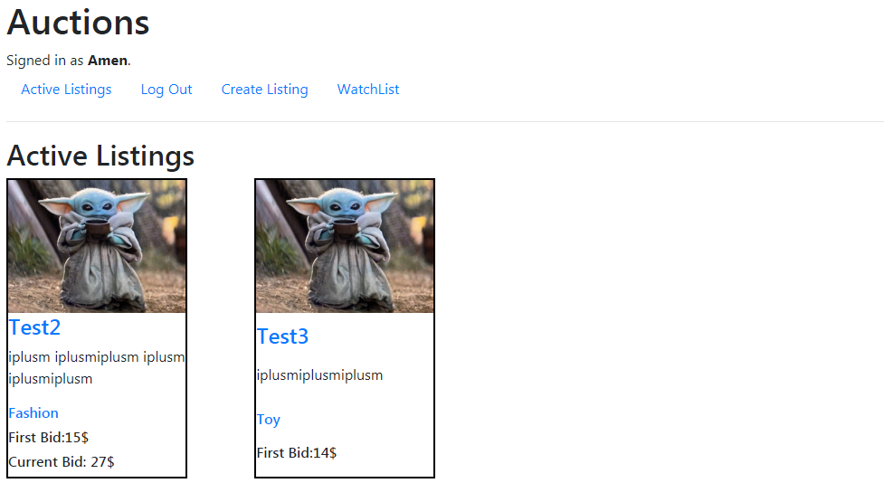

# Commerce

> Home page with two lists

---

## Description

  Commerce is an eBay-like e-commerce auction site. Unregistered people can only see the auctions from the homepage, registered users can post auction listings, place bids on listings, comment on those listings, and add listings to a **watchlist**.

#### What i have used

- HTML
- Css
- Python
- Django
- Bootstrap

[Back To The Top](#commerce)

---

## How To Use

- ### Checking List
  If user want to check a list he just to *Clicks* on the list he wants. \
  When user clicks on:

    - `ADD/REMOVE WATCHLIST`: This list will get add to his **Watchlist**, if the list is already in his **watchlist** it will get removed from it.

    - `Category`: The user will get redirected to a page that shows every list that have the same **category**.

  ###### The User that created the list have two more buttons:

    - `CLOSE AUCTION`: It will take the **Higher** bid as the **Winning** bid, and the comments sections will get closed.

    - `DELETE AUCTION`: It will delete the auction **permanently!**

- ### Create Listing
  When user *clicks* on `Create Listing` he will get redirected to a page where he's able to create an auction list. User needs to implement a **Title**, **Description**, **The starting bid**, **Category** and **URL for an image -optional-**.
  > See what [Create](https://github.com/amen6/Commerce/blob/main/Images/Create.png) auction looks like

- ### Adding bid  
  In the [List](#checking-list), there's a **Bid box** where user can add bids, the added bid should be **Higher** than the *Current bid*

- ### Adding comment

  In the [List](#checking-list), there's a **Comment box** where user can add *comments*. All comments will show in the **Comments part** under the list, every comment will shown as **Username** and the **Comment content**.

[Back To The Top](#commerce)

---
