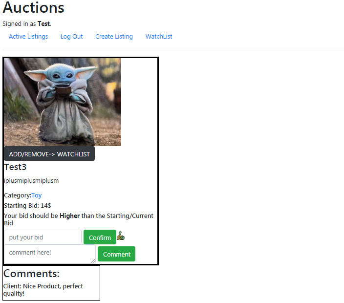

# Commerce
I designed an eBay-like e-commerce auction site that will allow users to post auction listings, place bids on listings, comment on those listings, and add listings to a *“watchlist"*.
First, you need to login or the only thing you will be able to do is looking at from homepage

After you login, your homepage will look like this 
By clicking on *Crate Listing* you will be taken to a page where you are able to create an auction list,

I used **forms.ModelForm** for this page, you need to implement a (title, description, the starting bid, select a category, and it's optional to provide a URL for an image to use in your auction list).
Also if you want to check a list you can just click on its title and you will be redirected to that auction list page,

You can see the image if available, the title and description too, and by clicking on *ADD/REMOVE-> WATCHLIST* you will add this auction to your watchlist where you can access it by clicking on *Watchlist* button on the top, and by clicking on the category which is *Toy* here, you will get redirected to page that shows you all auctions lists with the same category, in the bid box a bid less than the starting bid or the current bid if available won't be acceptable, and you can insert a comment in the comment box and the comment will appear at the bottom with the username too.
The list creator have more access like *Delete List* and *Close List* as we can see here

*Delete List* will delete the auction list permanently and *Close List* will close comments and bids and the bigger bid will be considered as the winning bid.
